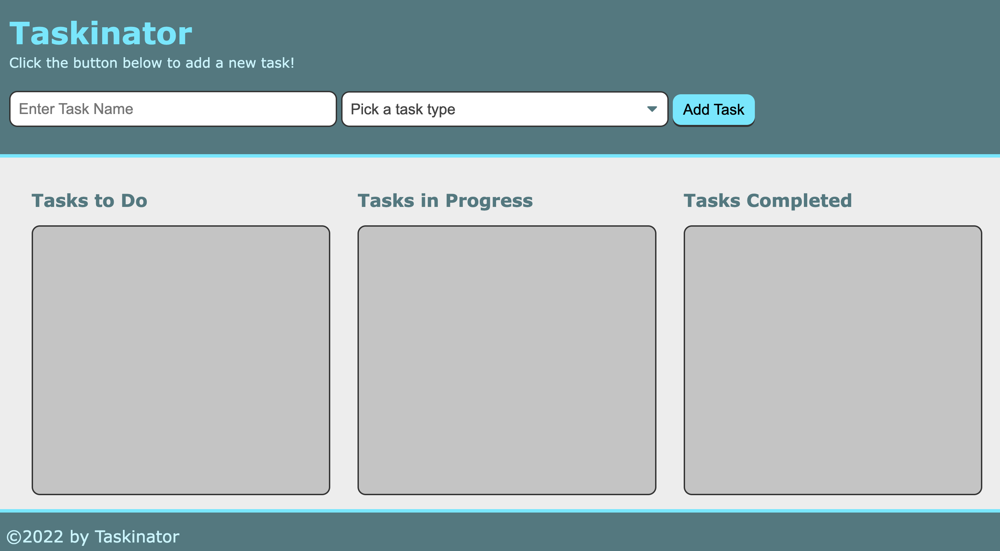
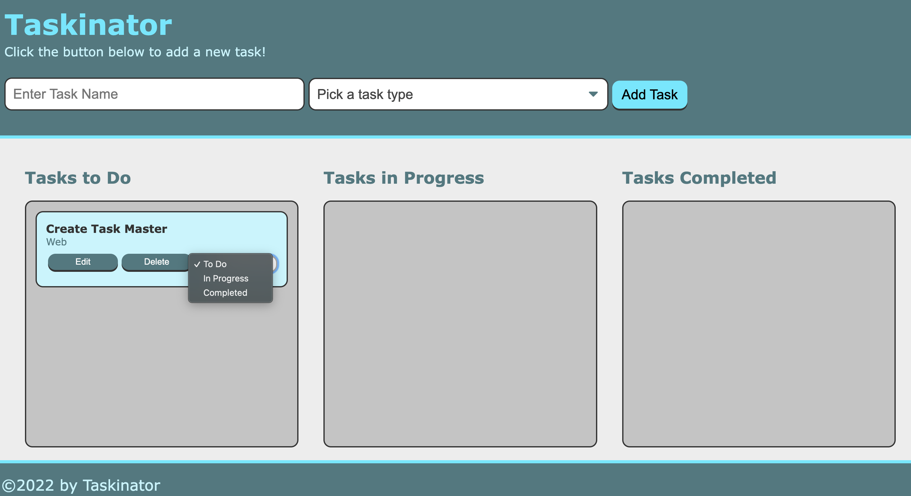

# Taskinator

## A front end application that utilizes web APIs to create an interactive toDo list

This application is a user interactive task generator. It lets the user create a task and assign it a type. The application then creates the task and places it into the "Tasks to Do" section of the page. Through a checkdown that is created with each task, the user can change the status of the task, or delete the task using the delete button. The user also has the ability to edit the task once it has been created and appended to the page. The application utilizes local storage to save the user created tasks and persist the task when the page is reloaded. 

The following is a link to the deployed application: https://charanvir.github.io/Taskinator/

Below is are screenshots of the deployed application:
- 
- 
